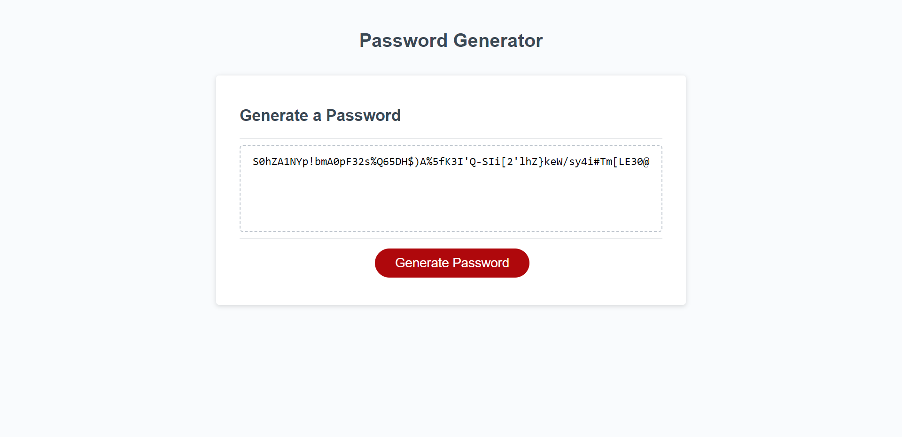

# Password-Generator
Module 5 Challenge: Password Generator

## Description

It is tasked to create an application that an employee can use to generate a random password based on criteria they’ve selected by modifying starter code. This app will run in the browser, and will feature dynamically updated HTML and CSS powered by JavaScript code that you write. It will have a clean and polished user interface that is responsive, ensuring that it adapts to multiple screen sizes.

### User Story

AS A client, I WANT to have a web application that users can use to generate a random password based on criteria they’ve selected.

### Acceptance Criteria

* Generate a password when the button is clicked
  * Present a series of prompts for password criteria
    * Length of password
      * At least 10 characters but no more than 64.
    * Character types
      * Lowercase
      * Uppercase
      * Numeric
      * Special characters ($@%&*, etc)
  * Code should validate for each input and at least one character type should be selected
  * Once prompts are answered then the password should be generated and displayed in an alert or written to the page

### Mock up and Functionality

The following image shows the web application's appearance and functionality:

When a user clicks on the 'Generate Password' button,
1. A prompt pops up to ask for entering the length [10 - 64] of the password.
2. The application validates the input for the following password criteria:

   * Password length must not be empty and alert if invalid input has been entered
   * Password length that must not start with '0' and alert if invalid input has been entered
   * Password length must only contain numeric characters and alert if invalid input has been entered
   * Password length must be between 10 and 64 inclusive and alert if invalid input has been entered

3. Upon validation, a series of prompts pop up to ask for any of the following character types to be used in the password.

      * Lowercase
      * Uppercase
      * Numeric
      * Special characters

4. The application then validates each input and at least one character type should be selected.
5. Once prompts are answered then the password should be generated and displayed to the page.

### Review

TA, a Web Developer, reviews the code, providing feedback on errors and making sure that all of the acceptance criteria have been met.

* [The URL of the deployed application.](https://seacrest3.github.io/Password-Generator/)

* [The URL of the GitHub repository.](https://github.com/seacrest3/Password-Generator.git)

### Helpful Resources

- [MDN Javascript Documentation](https://developer.mozilla.org/en-US/docs/Web/JavaScript/)

- [W3Schools Javascript](https://www.w3schools.com/js/)

- [JavaScript Tutorial](https://www.javascripttutorial.net/)

- [Stack Overflow](https://stackoverflow.com/questions/4550505/getting-a-random-value-from-a-javascript-array)

- [The OWASP Foundation - Special Characters](https://www.owasp.org/index.php/Password_special_characters)

- [freeCodeCamp.org](https://www.freecodecamp.org/)

- [Github Pages Guide](https://pages.github.com/)
